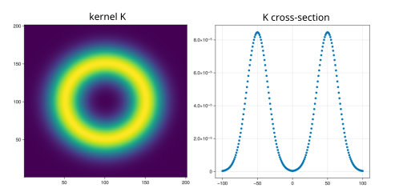
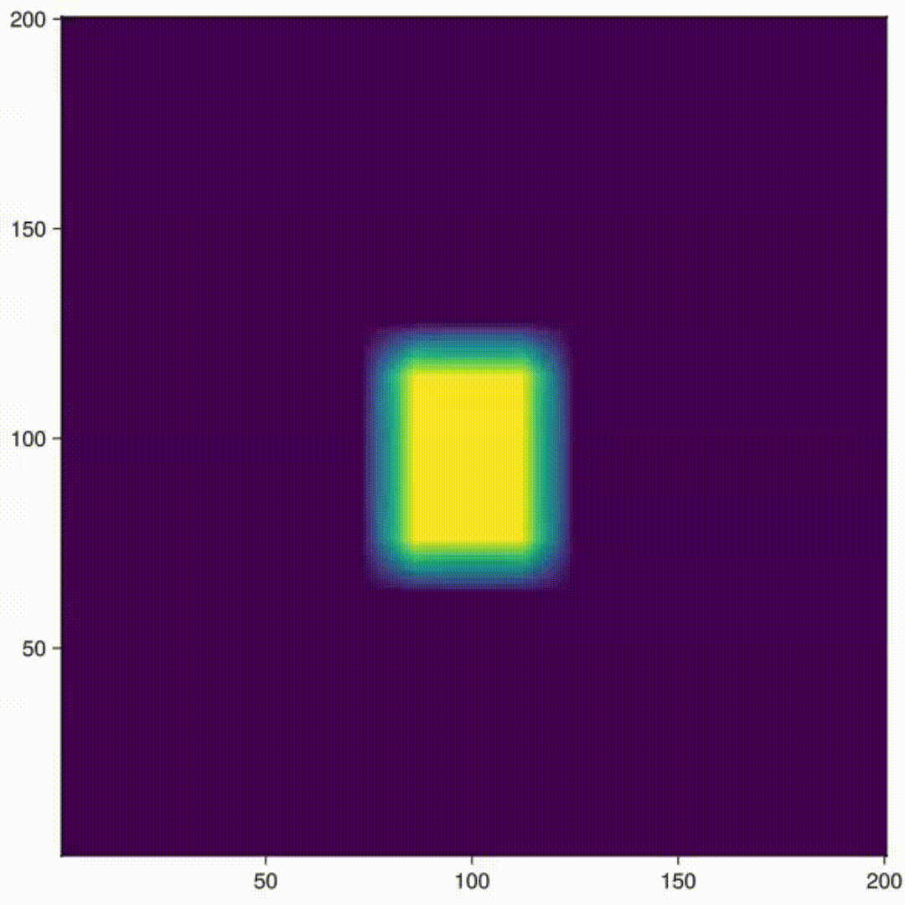

# Lenia: Continuous Cellular Automaton in Julia

This package provides a simulation of a continuous version of the Game of Life, named **Lenia**, in Julia. Unlike the traditional Game of Life, which is based on a discrete grid, Lenia uses continuous space and time to simulate evolving "organisms". It allows for the creation of more dynamic, smooth, and realistic simulations of life-like structures. 

## Overview

Lenia is inspired by the concept of cellular automata but takes a continuous approach. In this package, the cells are replaced by evolving entities that can smoothly transition between states. These entities can grow, move, and interact with their surroundings, mimicking natural phenomena.

This Julia package implements basic functionality for simulating the growth of cells and applying kernel-based transformations to model the behavior of such organisms. It also provides tools for visualizing the evolution of the system over time.

## Algorithm

1. **Matrix Representation**:
   - The environment is represented by a matrix (`A`), where each element represents the state of a cell at that point in space.
   - The matrix is updated over time using specific rules of growth and interaction.

2. **Patterns**:
   - Predefined patterns, like the "pulsar", are used as starting configurations for the simulation.
   - These patterns are resized and placed in the matrix.

3. **Kernel Convolution**:
   - A convolution kernel (`K`) is used to model interactions between cells and their neighbors.
   - This kernel is applied to the matrix to simulate the effect of surrounding cells on the growth of a particular cell.
     
   

4. **Growth Function**:
   - The growth of cells is calculated using a **bell function**, which models the influence of neighboring cells on a given cell.
   - The growth is continuous, meaning the state of each cell evolves smoothly, and this effect is influenced by parameters like `m` and `s`.

5. **Simulation**:
   - The matrix is updated at each iteration based on the interactions calculated through the kernel.
   - The simulation runs for a specified number of iterations, and at each step, the matrix is updated, showing the evolution of the life-like entities.

6. **Visualization**
    - The state of the matrix is visualized using **heatmaps** to show the density and evolution of cells over time. The matrix is updated and displayed at each iteration.

## Examples

## Installation

To install the package, simply run the following command in Julia's REPL:

